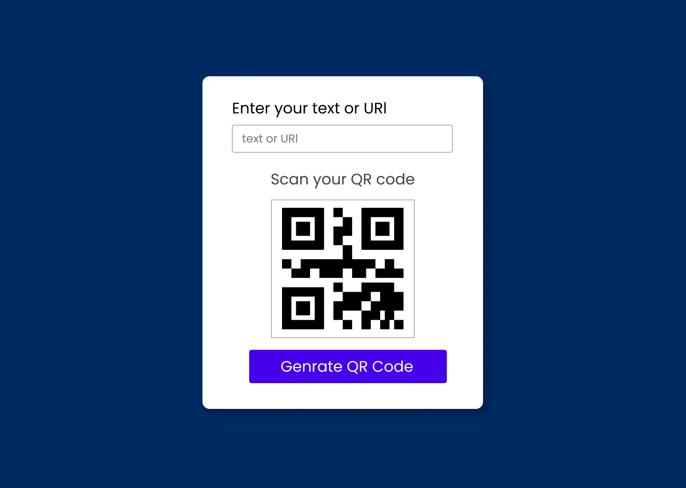

# QR Code Generator 🚀  

A simple and responsive **QR Code Generator** built using **HTML**, **CSS**, and **JavaScript**. Enter any text or URL, and instantly generate a QR code!  

## 🎯 Features  

- ✅ Generates QR codes from text or links  
- ✅ Simple and clean UI  
- ✅ Fully responsive design  
- ✅ Easy to use  

## 🛠️ Technologies Used  

- **HTML** – Structure  
- **CSS** – Styling  
- **JavaScript** – QR Code Generation  

## 📸 Preview  

  

##

## Live Demo  
[**View the Live Project**](https://dark1arrow.github.io/QR-Genrator/)  

## Figma Design  
[**View Figma Design**](https://www.figma.com/design/rervNKegOt7yXEDeSnH9UC/java-script-project?node-id=161-3&t=GyAfNPeDQvjWF26o-1)  

## LinkedIn 
[**Check LinkedIn**](https://www.linkedin.com/in/gouatm-khanna-61ba63262/?utm_source=share&utm_campaign=share_via&utm_content=profile&utm_medium=android_app)
  
